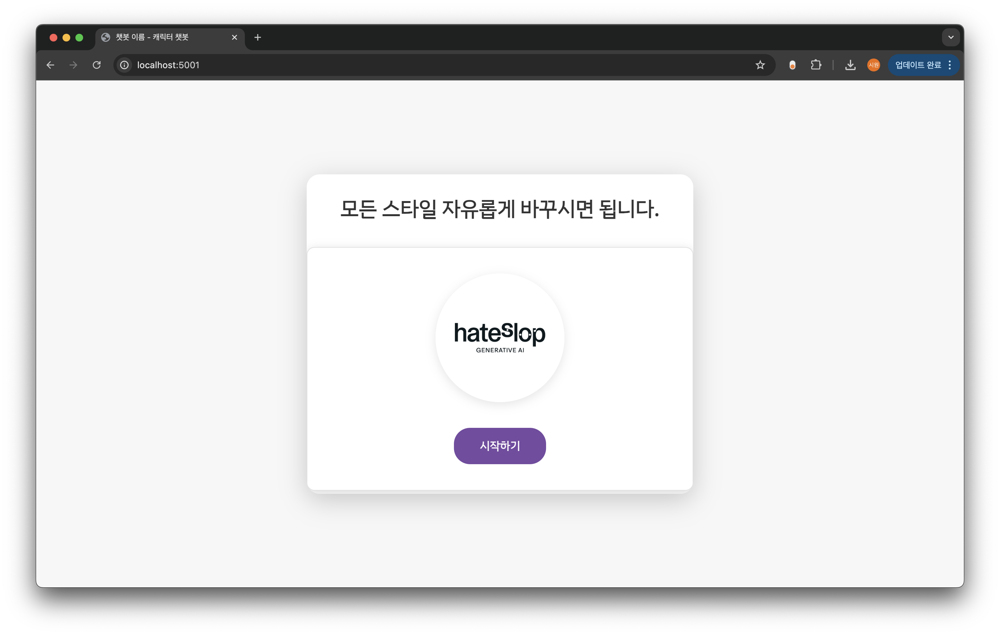
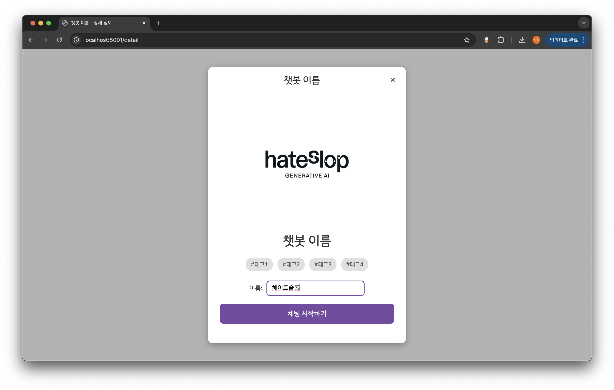
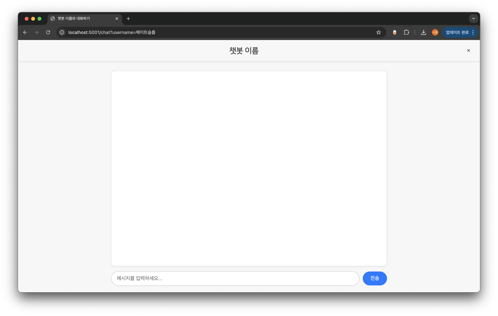

# HateSlop 3기 엔지니어x프로듀서 합동 캐릭터 챗봇 프로젝트

GOAL)

- AI를 이용해 빠르게 개념에 대해 학습하고 실습을 진행합니다.
- AI를 적극적으로 활용하여 코드를 작성하세요.
- AI가 코드를 짜는 것을 보며 AI가 할 수 있는 것과 내가 할 수 있는 것에 대한 성찰을 얻으세요.
- 앞으로 코드는 사람이 짜지 않을 것입니다. 그 시간에 AI가 할 수 없는 것과 본인 내실에 집중하여 몸값을 기르세요.
- 바이브코딩 등 현재 유행하는 모든 AI 기법을 체화하는 것까지가 프로젝트의 목적입니다.

> 운영진이 최신 Claude 4.5 모델과 함께 구성한 모범답안은 `answer-sheet` 브랜치에 있습니다.  
> 답안을 공개하고 AI 활용을 장려하는 이유는 다음과 같습니다.
>
> 첫째, Hateslop 학회원은 스스로 배우고자 하는 의지가 검증된 사람들로, 자기주도적 학습이 전제되어 있습니다.  
> 우리는 여러분이 단순히 제출을 위한 과제를 작성하지 않을 것이라는 믿음을 가지고 있습니다.
>
> 둘째, 오늘날 AI로 정답을 찾는 것은 어렵지 않습니다.  
> 중요한 것은 그 정답에 이르기까지의 사고 과정과 추론 능력, 그리고 더 나은 답을 도출하려는 문제 해결력을 기르는 일입니다.
>
> 그렇기 때문에 단순히 결과를 복제하는 데 그치지 말고, AI를 도구로 삼아 스스로 사고하고 탐구하며 성장하길 바랍니다.

> \*바이브코딩 교육은 학회 커리큘럼에 맞춰 추후 진행될 예정입니다.

TIPS)

- 유료) 바이브코딩 툴을 이용한다면 그를 활용하세요.
- 무료) repomix 를 이용해 코드베이스 전체를 google ai studio 에 넣어서 정확한 내용 기반으로 LLM 과 분석하세요. (Google AI Studio 를 쓰는 이유는 처리할 수 있는 Token 수가 1M으로 타 서비스 대비 압도적으로 많고 무료이기 때문)

  [repomix 활용방법](https://pickle-snail-efe.notion.site/AgentOps-241e1458c63781dba0b1d451eddb3b48)

  [gitingest : GitHub 저장소를 LLM 친화적인 텍스트로 변환하는 도구](https://discuss.pytorch.kr/t/gitingest-github-llm/6896)

  [deepwiki : Github 기반 프로젝트 분석방법](https://deepwiki.org/)

[](https://opensource.org/licenses/MIT)
[](https://www.python.org/)
[](https://www.docker.com/)

## ⚡ 빠른 시작

- hateslop organization에서 fork 한 것이라 가정
- docker desktop 설치 및 실행한 상태라 가정

```bash
# 1. Fork & Clone
git clone https://github.com/YOUR_USERNAME/chatbot-project.git
cd chatbot-project

# 2. .env 파일 생성 및 API 키 입력
cp .env.example .env
nano .env  # OPENAI_API_KEY 입력

# 3. Docker 실행
docker compose up --build

# 4. 브라우저에서 http://localhost:5001 접속
```

**정상 작동 화면**

메인 페이지



상세 페이지



채팅 페이지



---

## 📚 문서 가이드

| 문서                                                | 내용                         | 비고     |
| --------------------------------------------------- | ---------------------------- | -------- |
| **[README.md](README.md)** ⭐⭐                     | 프로젝트 개요 (필독)         | 현재문서 |
| **[ARCHITECTURE.md](ARCHITECTURE.md)** ⭐⭐         | 시스템 아키텍처 (필독)       | 필독     |
| **[DOCKER_HOT_RELOAD.md](DOCKER_HOT_RELOAD.md)** 🔥 | Docker 개발 환경 실전 가이드 | (참고)   |
| **[DOCKER_GUIDE.md](DOCKER_GUIDE.md)**              | Docker 사용 완전 가이드      | (참고)   |
| **[ADVANCED_TOPICS.md](ADVANCED_TOPICS.md)** 🚀     | 성능 개선 & 최신 기술 트렌드 | (심화)   |

---

## 🎯 프로젝트 개요

헤이트슬롭 프로듀서 엔지니어 합동 프로젝트입니다.

- 📖 **학습 목표**: RAG, Embedding, LLM, Vector Database
- 👥 **협업 방식**: 프로듀서가 기획한 내용을 바탕으로 캐릭터 챗봇을 완성
- 🚀 **배포**: Vercel CLI를 통한 프로덕션 배포
- 🐳 **환경**: Docker로 일관된 개발 환경 보장

### 핵심 기능

- 🤖 **OpenAI GPT** 기반 대화 생성
- 📚 **RAG** (Retrieval-Augmented Generation)를 통한 지식 기반 답변
- 💾 **ChromaDB**를 활용한 임베딩 벡터 저장
- 🧠 **LangChain** 기반 대화 메모리 관리
- 🎨 **Vanilla JavaScript** 기반 웹 인터페이스
- 🐳 **Docker**를 통한 환경 일관성 보장

### 기술 스택

- **Backend**: Flask (Python 3.11)
- **AI**: OpenAI API, LangChain, ChromaDB
- **Frontend**: Vanilla JavaScript, HTML, CSS
- **Deployment**: Docker, Vercel CLI
- **Version Control**: Git, GitHub

## 🏗️ 프로젝트 구조

```
chatbot-project/
├── app.py                     # 🚫 템플릿 (수정 금지, 수정 원한다면 의존성 있는 파일)
├── services/
│   ├── __init__.py
│   └── chatbot_service.py     # ✏️ 학회원 구현 파일 (AI 로직)
├── config/
│   └── chatbot_config.json    # ✏️ 챗봇 설정 (예시)
├── static/
│   ├── data/
│   │   └── chatbot/
│   │       └── chardb_text/   # ✏️ 텍스트 데이터 (예시)
│   ├── images/
│   │   └── chatbot/           # ✏️ 이미지 파일
│   ├── videos/
│   │   └── chatbot/           # ✏️ 비디오 파일 (선택)
│   ├── css/
│   │   └── style.css          # 🚫 템플릿 (수정 금지, 스타일 변경 원하면 수정 가능)
│   └── js/
│       └── chatbot.js         # 🚫 템플릿 (수정 금지, 수정 원한다면 의존성 있는 파일 함께 수정)
├── templates/
│   ├── index.html             # 🚫 템플릿 (수정 금지, 수정 원한다면 의존성 있는 파일 함께 수정)
│   ├── detail.html            # 🚫 템플릿 (수정 금지, 수정 원한다면 의존성 있는 파일 함께 수정)
│   └── chat.html              # 🚫 템플릿 (수정 금지, 수정 원한다면 의존성 있는 파일 함께 수정)
├── Dockerfile                 # 🚫 템플릿
├── docker-compose.yml         # 🚫 템플릿
├── requirements.txt           # 🚫 템플릿
├── vercel.json                # 🚫 템플릿
├── .env.example               # 참고용
└── README.md                  # 현재 파일
```

### 📁 파일별 역할

#### 🚫 템플릿 파일 (수정하지 마세요!)

- `app.py`: Flask 애플리케이션 핵심 로직
- `templates/*.html`: 웹 UI 템플릿
- `static/css/`, `static/js/`: 프론트엔드 리소스
- `Dockerfile`, `docker-compose.yml`: Docker 설정
- `requirements.txt`: Python 의존성

> _커스텀 원하시면 수정하셔도 되지만, 의존성을 가진 파일을 같이 수정하셔야 합니다._

#### ✏️ 작성/수정할 파일

- `services/chatbot_service.py`: **AI 로직 구현** (RAG, Embedding, LLM)
- `config/chatbot_config.json`: 챗봇 설정 (이름, 성격, 시스템 프롬프트)
- `static/data/chatbot/chardb_text/`: 텍스트 데이터 (json, markdown, txt 자유롭게 사용하시면 됩니다.)
- `static/images/chatbot/`: 챗봇 관련 이미지

## 📚 학습 자료

### 공식 문서

1. **OpenAI API Documentation**
   - https://platform.openai.com/docs
2. **LangChain Documentation**
   - https://python.langchain.com/docs
3. **ChromaDB Documentation**
   - https://docs.trychroma.com/

### 추천 논문

1. **RAG 기초**: "Retrieval-Augmented Generation for Knowledge-Intensive NLP Tasks" (Lewis et al., 2020)

   - https://arxiv.org/abs/2005.11401

2. **Self-RAG**: "Self-RAG: Learning to Retrieve, Generate, and Critique" (Asai et al., 2024)
   - https://arxiv.org/abs/2310.11511

**더 많은 자료**: [ADVANCED_TOPICS.md](ADVANCED_TOPICS.md#-관련-논문-및-연구)
